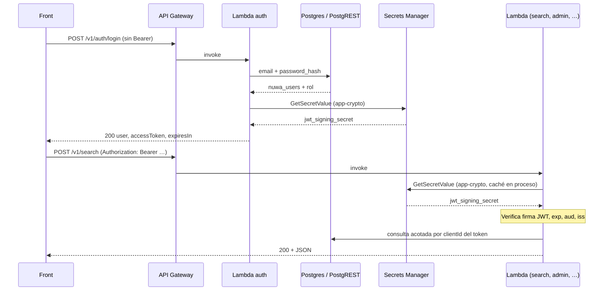
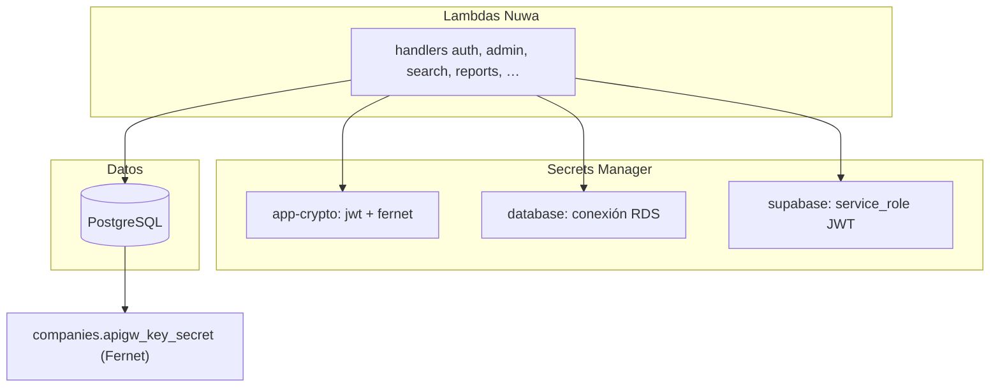
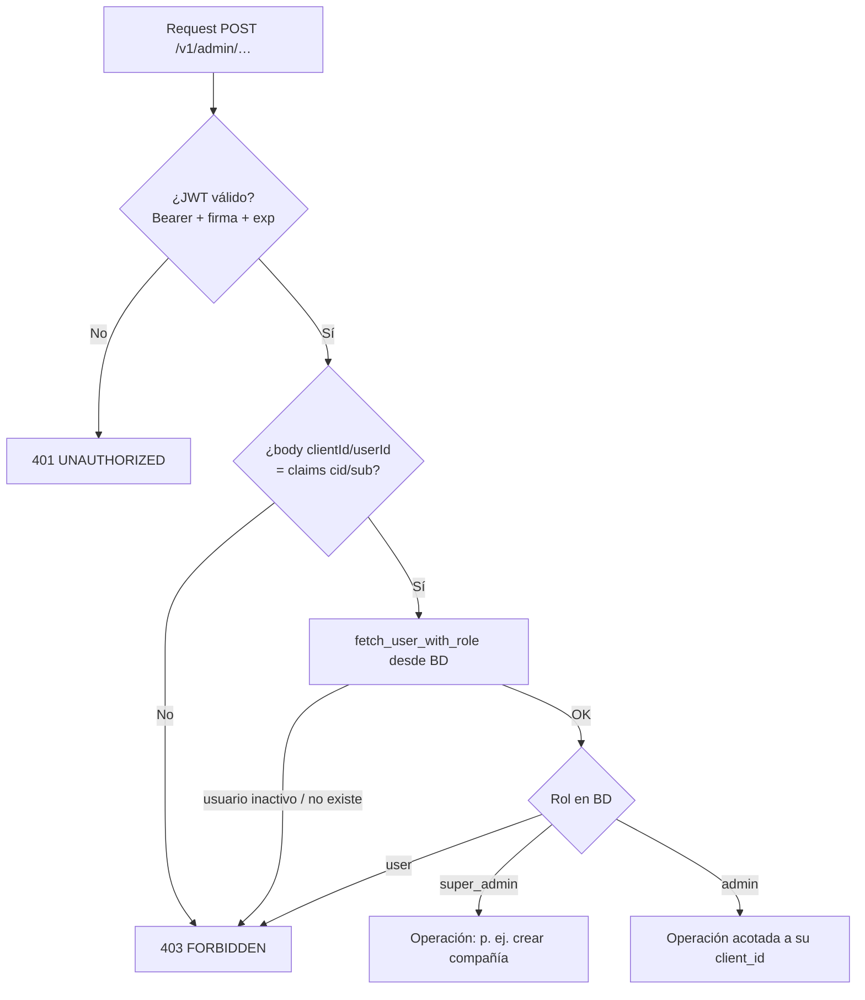

# Nuwa 2.0 — decisiones de arquitectura y contratos JSON (API)

Región AWS: **us-east-1**. Escala prevista: texto puro, **menos de 10 GB** en ~2 años; chunks pequeños.

---

## 1. Identidad: JWT + body (`clientId`, `userId`) y keys de API Gateway

Tras **`POST /v1/auth/login`**, el cliente envía **`Authorization: Bearer <accessToken>`** en (casi) todas las rutas. El token es un **JWT** (HS256) firmado con un secreto almacenado en **Secrets Manager** (`nuwa2/<env>/app-crypto`, JSON con `jwt_signing_secret` y `fernet_key`). Claims relevantes: `sub` (user id), `cid` (clientId), `role` (slug), `exp`, `iss`=`nuwa2`, `aud`=`nuwa2-api`.

Los handlers siguen pidiendo **`clientId`** y **`userId`** en el body (o query) donde ya existía contrato; la Lambda **comprueba que coincidan con el JWT** (salvo `super_admin`, que puede actuar sobre cualquier tenant donde el negocio lo permita).

**API Keys en API Gateway (M2M / cuotas):** al crear una compañía se sigue creando una key por tenant y enlazándola al usage plan. El valor secreto se guarda en **`companies.apigw_key_secret` cifrado con Fernet** (clave `fernet_key` en el mismo secreto `app-crypto`). La respuesta de alta puede incluir **`apiKey` en claro una vez** para scripts. **API Gateway** tiene `api_key_required=false` en las rutas de negocio documentadas aquí: la **autorización** la hace la Lambda validando el JWT, no la key en el gateway.

**Mejoras de seguridad recomendadas (evolución):**

- **Corto plazo:** rotar `jwt_signing_secret` y `fernet_key` en producción tras el deploy; TTL del JWT vía `NUWA_JWT_TTL_SECONDS` (default 8 h).
- **Medio plazo:** **refresh tokens** (httpOnly cookie o tabla de revocación); **RS256** con par de claves en KMS; **Lambda authorizer** en API Gateway para no duplicar verificación en cada handler.
- **Alto:** **KMS envelope** para la columna de API key en lugar de Fernet con clave en un solo JSON; **WAF** / rate limit en el stage al quitar API Key obligatoria en gateway.

Compañías **antiguas** con `apigw_key_secret` en texto plano: al descifrar, si falla Fernet se asume legado plano hasta que se vuelva a escribir la key cifrada.

### Login de aplicación (`POST /v1/auth/login`)

- **No** exige `x-api-key` ni Bearer (ruta pública en gateway).
- Body: `email`, `password`, y opcionalmente **`clientId`** si hay colisión de email entre tenants.
- Respuesta **200:** `user`, `company`, **`accessToken`** (JWT), `tokenType`, `expiresIn`.
- Contraseñas: **pbkdf2_sha256** (`nuwa_password`).

### Diagrama: login y llamadas posteriores



### Diagrama: capas de secretos



### Diagrama: decisión en rutas **admin**

Cada petición admin pasa por la misma cadena antes de llegar a la lógica de negocio (`handler_admin.py`):



**Nota:** el claim `role` del JWT se emite en login, pero las comprobaciones críticas de admin usan **`role_slug` leído de base de datos** en el momento de la petición (si degradas a alguien en BD, deja de pasar aunque el token viejo diga otra cosa, salvo que el token siga siendo válido y el body siga alineado; el riesgo residual es la ventana hasta `exp`).

### Tabla: permisos admin (resumen)

| Rol en BD | Listar compañías | Crear / borrar compañía | Actualizar compañía | Usuarios (list/create/update) |
|-----------|------------------|-------------------------|----------------------|----------------------------------|
| `super_admin` | Todas | Sí | Cualquier `targetClientId` | Cualquier `targetClientId` |
| `admin` | Solo la suya | No (403) | Solo si `targetClientId` = su `client_id` | Solo su tenant |
| `user` | — | — | — | 403 en admin |

Implementación: `nuwa_rbac.py` (`can_manage_company`, `can_manage_users`) y comprobaciones explícitas en `companies_create` / `companies_delete`.

### Search y reportes

- **JWT obligatorio.** El `clientId` del body o query debe estar permitido: igual al claim `cid`, o bien el rol en el token es `super_admin` (sin acotación forzada por tenant en listados).
- **Rol `user` en reportes:** al guardar, el `userId` del body debe coincidir con `sub` del token (no puede crear reportes “como otro usuario”).

### Modelo de amenazas (resumen)

| Riesgo | Mitigación actual | Mejora posible |
|--------|-------------------|----------------|
| Robo de `accessToken` (XSS, logs) | TTL corto (`NUWA_JWT_TTL_SECONDS`); HTTPS | Refresh en httpOnly cookie; revocación por `jti` |
| Fuga del secreto `app-crypto` | IAM mínima en Lambdas; no commitear | Rotación de secretos; KMS para Fernet/JWT |
| Fuga de dump de BD | `apigw_key_secret` cifrado con Fernet | KMS envelope; column-level encryption |
| Abuso sin API Key en gateway | Cualquiera puede invocar URL (coste/throttle) | WAF, usage plan alternativo, authorizer en GW |
| Suplantación body vs token | `jwt_matches_actor_body` + lectura de rol en BD | Mantener; opcional Lambda authorizer centralizado |

### Contrato OpenAPI

La especificación **`openapi/openapi.yaml`** declara `BearerAuth`, el resumen de RBAC en `info.description`, y descripciones por ruta admin. Swagger UI no ejecuta las Lambdas: es documentación y contrato, no sustituto de pruebas de seguridad.

---

## 2. Fuentes (catálogo): quién crea qué y visibilidad

| Actor | `userId` / `clientId` | Comportamiento |
|--------|------------------------|----------------|
| **Administrador Nuwa** | `userId = 1`, `clientId = 1` | Crea fuentes desde la interfaz; **siempre `visibility: public`**. |
| **Usuario empresa** | `userId ≠ 1`, `clientId ≠ 1` | Puede cargar uno o varios documentos y definir la fuente como **`private`** (solo su `clientId`) o **`public`** (todos los clientes). |

**Lectura de chunks en búsqueda:** se devuelven filas con `visibility = 'public'` **o** `client_id = clientId` del request (ya implementado en `search_risk_entities` vía `p_client_id`).

---

## 3. Flujo con Grok (contexto de producto)

- **Grok** extrae estructura/texto del documento; el **front** llama al API para **crear/actualizar la fuente en catálogo** y **insertar chunks**.
- La **respuesta JSON de búsqueda** se envía de vuelta a **Grok** para redactar el **reporte**.

Este repositorio no integra Grok; solo debe exponer contratos estables y payloads claros para ese flujo.

---

## 4. Actualización de chunks

Se acepta una **ventana breve sin datos** entre borrado y re-carga de chunks (no se exige reemplazo atómico).

---

## 5. Búsqueda por nombre y/o RFC (México)

El usuario puede enviar **solo nombre**, **solo RFC**, o **ambos**. La lógica en base es **OR** con puntuación por el mejor match (`score`).

- **RFC:** se normaliza (mayúsculas, sin espacios ni guiones) y se compara contra `chunk_text` normalizado de la misma forma, además de `word_similarity` y `fts` cuando aplica.

---

## 6. ¿Qué es “IaC” (pregunta 7)?

**Infrastructure as Code:** definir Lambda, API Gateway, IAM, etc. en archivos versionados en lugar de crearlos a mano en la consola.

Opciones habituales:

- **AWS SAM** — plantillas YAML cercanas a CloudFormation; muy usadas con Lambda + API.
- **Terraform** — proveedor AWS, popular en equipos multi-nube.
- **AWS CDK** — TypeScript/Python/Java que genera CloudFormation.

**Recomendación para Nuwa 2.0:** **SAM** o **CDK en Python** si todo el backend ya es Python; el equipo elige uno y lo unifica.

---

## 7. Un solo API REST, JWT, usage plan y prefijo

**Autenticación de aplicación:** rutas de negocio (sources, chunks, search, reports, admin) tienen **`api_key_required=false`** en API Gateway; el cliente envía **`Authorization: Bearer <JWT>`** tras login. El secreto **`nuwa2/<env>/app-crypto`** (outputs **`AppCryptoSecretArn`**) debe contener JSON con `jwt_signing_secret` (≥32 caracteres) y `fernet_key` (salida de `Fernet.generate_key().decode()`).

**Usage plan y API Keys:** el stack mantiene un **usage plan** y una **API key de plataforma** más **keys por tenant** (outputs **`ApiKeyId`**, **`UsagePlanId`**). Siguen sirviendo para cuotas/M2M frente a AWS; la validación de identidad de usuario en Lambda es el **JWT**.

**Nombres de key de tenant:** `{NuwaResourcePrefix}-tenant-{client_id}` (prefijo igual al de Lambdas/API).

**Prefijo de nombres físicos** (definido en `cdk/nuwa2/nuwa_naming.py` y usado por `nuwa_api_stack.py`):

`nuwa2-<región-aws>-<environment>-…`

Ejemplo con `environment=prod` y región `us-east-1`: **`nuwa2-us-east-1-prod-`**. Sufijos habituales:

| Recurso | Nombre |
|---------|--------|
| API Gateway REST | `nuwa2-us-east-1-prod-api` |
| Lambda — sources | `nuwa2-us-east-1-prod-lambda-sources` |
| Lambda — chunks ingest | `nuwa2-us-east-1-prod-lambda-chunks-ingest` |
| Lambda — search | `nuwa2-us-east-1-prod-lambda-search` |
| Lambda — reports | `nuwa2-us-east-1-prod-lambda-reports` |
| Lambda — admin | `nuwa2-us-east-1-prod-lambda-admin` |
| Lambda — auth | `nuwa2-us-east-1-prod-lambda-auth` |
| Usage plan | `nuwa2-us-east-1-prod-usage` |
| API Key plataforma (nombre) | `nuwa2-us-east-1-prod-api-key` |
| API Keys tenant | `{prefijo}-tenant-{client_id}` (creadas al dar de alta compañía) |

El output de CloudFormation **`NuwaResourcePrefix`** repite el prefijo sin guión final para scripts.

**Etiquetas AWS** (Resource Groups, Tag Editor, políticas por tag): en los recursos anteriores (y SSM/secreto asociados) se aplican `nuwa:project=nuwa2`, `nuwa:environment=<env>`, `nuwa:name-prefix=<prefijo>`, `nuwa:managed-by=cdk-nuwa2-api`.

**Borrado automático / limpieza:** lo correcto es **`cdk destroy`** sobre el stack `Nuwa2ApiStack-<environment>`: elimina API, Lambdas, keys ligadas al plan (según orden de borrado de API Gateway), integraciones, etc. Para recursos huérfanos o cuentas de prueba, puedes listar por prefijo o por tag, por ejemplo:

- API keys cuyo **nombre** empieza por el prefijo: `aws apigateway get-api-keys --name-query nuwa2-us-east-1-prod --include-values` (ajusta región y perfil).
- Recursos con tag: en la consola **Resource Groups → Tag-based** con filtro `nuwa:project` = `nuwa2`.

**Dependencias en el zip:** el directorio `cdk/lambdas` incluye código propio más lo instalado con **`./scripts/bundle_lambda_deps.sh`** (`psycopg`, `PyJWT`, `cryptography`, etc.). El runtime de Lambda ya trae `boto3`. Si el zip crece mucho, valorar **Lambda layer** o imagen **container**.

Contrato HTTP: **`openapi/openapi.yaml`**. Rutas bajo el mismo stage: `/v1/auth/login` (sin Bearer), luego `/v1/sources/*`, `/v1/chunks/ingest`, `/v1/search`, `/v1/reports/*`, `/v1/admin/*` con Bearer JWT.

**Una sola URL base para el front:** el output **`ApiBaseUrl`** del stack (p. ej. `https://{api-id}.execute-api.us-east-1.amazonaws.com/prod`). Todas las llamadas son `ApiBaseUrl` + path (p. ej. `POST .../prod/v1/search`). API Gateway **enruta por path y método** a la Lambda correspondiente; el navegador nunca invoca las ARNs de Lambda.

**CORS con front en dominio distinto:** el **preflight** (`OPTIONS`) lo resuelve **API Gateway** (orígenes `*`, cabeceras permitidas incluyen `Authorization` y `X-Api-Key`). Las respuestas **GET/POST/…** las devuelve la Lambda vía integración proxy; por eso cada handler añade cabeceras `Access-Control-Allow-*` (módulo compartido `cdk/lambdas/nuwa_http.py`). Detalle operativo: `cdk/README.md` § *URL base, rutas y CORS*.

---

## 8. Contrato JSON — envelope común (todos los POST/PUT/PATCH)

Campos mínimos que el cliente envía en el body junto al payload de la operación:

```json
{
  "clientId": 1234,
  "userId": 56,
  "requestId": "550e8400-e29b-41d4-a716-446655440000"
}
```

- **`requestId`:** opcional pero recomendado para trazas y correlación con Grok / front.

Las secciones siguientes añaden el payload específico **junto a** estos campos (mismo objeto JSON o `data` anidado; el implementador puede elegir; abajo se muestra **plano** en un solo objeto para simplicidad).

---

## 9. API de catálogo de fuentes (`sources`)

**`riskLevel`:** entero **1** = low, **2** = medium, **3** = high.

### 9.1 Crear fuente

**Reglas:** si `clientId === 1` y `userId === 1`, forzar `visibility: "public"`. Si `clientId !== 1`, permitir `public` | `private`.

```json
{
  "clientId": 1,
  "userId": 1,
  "requestId": "…",
  "name": "SAT",
  "riskLevel": 3,
  "visibility": "public",
  "metadata": { "description": "Listado oficial", "tags": ["mx"] }
}
```

**Response (ejemplo):**

```json
{
  "sourceId": 10042,
  "name": "SAT",
  "riskLevel": 3,
  "visibility": "public",
  "clientId": 1,
  "createdByUserId": 1,
  "createdAt": "2026-04-05T18:00:00Z",
  "updatedAt": "2026-04-05T18:00:00Z"
}
```

### 9.2 Actualizar fuente

```json
{
  "clientId": 1,
  "userId": 1,
  "sourceId": 10042,
  "name": "SAT (actualizado)",
  "riskLevel": 2,
  "metadata": { "description": "…" }
}
```

### 9.3 Eliminar fuente

```json
{
  "clientId": 1,
  "userId": 1,
  "sourceId": 10042
}
```

La implementación debe **borrar chunks** asociados (`DELETE … WHERE source_id = :sourceId`) antes o en la misma transacción que aplique; puede haber ventana breve según decisión de producto.

El catálogo vive en **Supabase** (`public.sources`). Los chunks referencian `sources.id` con `ON DELETE CASCADE`.

---

## 10. API de chunks (ingest / reemplazo)

### 10.1 Reemplazar todos los chunks de una fuente (acepta ventana sin datos)

```json
{
  "clientId": 1234,
  "userId": 56,
  "sourceId": 10042,
  "riskLevel": 2,
  "visibility": "private",
  "entityType": "company",
  "replaceStrategy": "all",
  "chunks": [
    {
      "order": 0,
      "chunkText": "Fuente: SAT | RFC: ABC123456789 | Razon social: EVCON GROUP SA DE CV | …"
    }
  ]
}
```

- **`replaceStrategy: "all"`:** borrar chunks existentes de `sourceId` y luego insertar el lote (puede dejar la fuente sin chunks unos segundos).
- **`riskLevel` / `visibility` / `entityType`:** por chunk se pueden sobreescribir en DB si el diseño lo requiere; hoy el esquema SQL usa un valor por fila — lo habitual es **mismos valores para todo el lote** en un ingest.

**Response (ejemplo):**

```json
{
  "sourceId": 10042,
  "deletedChunks": 1200,
  "insertedChunks": 1180,
  "status": "completed"
}
```

### 10.2 Append (opcional)

```json
{
  "clientId": 1234,
  "userId": 56,
  "sourceId": 10042,
  "replaceStrategy": "append",
  "chunks": [ { "order": 5000, "chunkText": "…" } ]
}
```

---

## 11. API searchEngine2.0 — búsqueda (body → Supabase RPC)

El Lambda traduce este JSON a la función `search_risk_entities` (PostgREST `rpc` o cliente Supabase).

### 11.1 Request

```json
{
  "clientId": 1234,
  "userId": 56,
  "requestId": "…",
  "query": "evcom group",
  "rfc": "ABC123456789",
  "entityTypes": ["company", "person"],
  "riskLevels": [1, 2, 3],
  "limit": 20,
  "wordSimilarityThreshold": 0.38
}
```

- **`query`:** opcional si mandas **`rfc`**; al menos uno de los dos debe venir no vacío.
- **`rfc`:** opcional; se normaliza en servidor/DB (mayúsculas, sin espacios ni guiones).
- **Alcance de fuentes:** el cliente **no** envía `sourceIds`. La búsqueda solo considera chunks **`visibility=public`** o **`private` con el mismo `clientId`** del request (igual que la RPC).
- **`entityTypes`**, **`riskLevels`**, **`limit`**, **`wordSimilarityThreshold`:** opcionales.

**Mapeo a RPC (nombres de parámetros):**

| JSON body | Parámetro SQL |
|-----------|----------------|
| `clientId` | `p_client_id` |
| `query` | `p_query` |
| `rfc` | `p_rfc` |
| `entityTypes` | `p_entity_types` |
| `riskLevels` | `p_risk_levels` |
| `limit` | `p_limit` |
| `wordSimilarityThreshold` | `p_word_similarity_threshold` |

### 11.2 Response (para el front y Grok)

Enriquecer en Lambda con datos del **catálogo** (`name` de la fuente) usando `sourceId`.

```json
{
  "requestId": "…",
  "clientId": 1234,
  "results": [
    {
      "chunkId": "a0eebc99-9c0b-4ef8-bb6d-6bb9bd380a11",
      "sourceId": 10042,
      "sourceName": "SAT",
      "riskLevel": 3,
      "entityType": "company",
      "score": 0.91,
      "rankTs": 0.12,
      "snippet": "… extracto con <mark>…</mark> si hubo match FTS …",
      "chunkText": "texto completo opcional; omitir si solo snippet al Grok"
    }
  ]
}
```

- **`sourceName` y `riskLevel` del catálogo:** no están en `risk_entity_chunks` salvo desnormalización; el **search Lambda** debe hacer **join o segunda lectura** por `sourceId`.
- **`chunkText`:** incluir solo si el reporte lo necesita; si no, `snippet` suele bastar para tokens.

---

## 12. PostgreSQL autogestionado (misma carga que Supabase)

**¿Varias bases de datos?** No hace falta. Todo el modelo vive en **una base de datos**, esquema **`public`** (tablas, funciones, índices). Con una cadena de conexión y un usuario con permisos de DDL en ese esquema puedes aplicar las mismas migraciones que en `supabase/migrations/` (en orden por timestamp).

**Extensiones**

| Extensión | Uso |
|-----------|-----|
| **`pg_trgm`** | Obligatoria para `word_similarity`, índices GIN trigram y la RPC `search_risk_entities`. En Postgres gestionado suele estar permitida; en instalaciones mínimas: `CREATE EXTENSION IF NOT EXISTS pg_trgm;` (antes o dentro del primer script que la use). |
| **`pgcrypto`** | Solo si tu versión no ofrece `gen_random_uuid()` sin extensión. En PostgreSQL reciente el UUID por defecto en tablas suele resolverse con `gen_random_uuid()` del núcleo; si falla, ejecuta `CREATE EXTENSION IF NOT EXISTS pgcrypto;`. |

El resto es SQL estándar: `plpgsql`, `jsonb`, `tsvector`, `GIN`, triggers.

**Row Level Security (RLS)**  
Las migraciones hacen `ENABLE ROW LEVEL SECURITY` en varias tablas **pero no definen políticas** en este repositorio. En Supabase el rol **`service_role`** evita RLS. En Postgres propio debes elegir una de estas opciones para el rol que use la API (PostgREST o cliente directo):

- Otorgar **`BYPASSRLS`** a ese rol, o  
- Desactivar RLS en esas tablas si solo existe un backend de confianza, o  
- Añadir políticas explícitas acorde a tu modelo de auth.

Sin eso, un rol normal podría no ver filas aunque tenga `SELECT` en la tabla.

**PostgREST / HTTP**  
Las Lambdas pueden usar **HTTPS + PostgREST** (Supabase) **o**, con el secreto `NUWA_DATABASE_SECRET_ARN` y `-c useDatabase=true` en CDK, **PostgreSQL directo con `psycopg`** (RDS u otro). Guía operativa: **`docs/RDS_LAMBDA.md`**.

---

### 12.1 Búsqueda cuando el nombre no coincide exactamente

La función `search_risk_entities` combina dos mecanismos sobre **`chunk_text`** (texto plano del chunk, p. ej. fila SAT serializada):

1. **`word_similarity` (trigramas, extensión `pg_trgm`)**  
   Tolera **erratas leves**, distancia de edición corta y nombres **embebidos en texto largo**. El umbral por defecto de la RPC es **`p_word_similarity_threshold = 0.38`** (configurable por request vía `wordSimilarityThreshold` en el body del API). Valores **más bajos** devuelven más candidatos (más ruido); **más altos**, menos resultados pero más estrictos.

2. **FTS con `websearch_to_tsquery('simple', q)`**  
   Pesa bien cuando los **tokens** del nombre aparecen **correctos** en el chunk; no corrige typos en el sentido fuzzy, pero suma puntuación y genera `snippet` con `<mark>`.

El **`score`** que ordena los resultados es el máximo entre esas señales (y, si aplica, RFC normalizado + substring en texto sin espacios/guiones).

**Cuándo puede “no encontrar” nadie**

- El nombre buscado está **muy deformado** respecto al texto indexado (trigramas caen por debajo del umbral).  
- **`query` muy corto** o poco discriminativo frente a millones de trigramas en chunks enormes.  
- El nombre **no está en `chunk_text`** (error de ingest o chunking).  
- Umbral **demasiado alto** para tu corpus.

**Palancas de mejora (sin cambiar de motor)**

- Bajar **`wordSimilarityThreshold`** en pruebas (p. ej. 0.3) y medir precisión/recall.  
- Mejorar **ingest**: asegurar que el nombre relevante quede en `chunk_text` (o campo dedicado si en el futuro lo añades).  
- Opcional en SQL: extensión **`unaccent`** + columna normalizada para homogeneizar acentos; o columnas **`phonetic`** (doble metáfon) para casos muy ruidosos — ya es diseño a medida.

Para búsqueda “semántica” (sinónimos, reformulaciones) haría falta otro componente (embeddings + índice vectorial, u otro servicio de búsqueda), no solo trigramas + FTS.

---

## 13. Archivos relacionados

- **OpenAPI 3.0 (Swagger):** `openapi/openapi.yaml` — importable en API Gateway o Swagger UI (JWT, RBAC admin descritos en `info` y rutas).
- **Infra AWS (CDK Python, us-east-1):** `cdk/` — ver `cdk/README.md` y despliegue desde GitHub (`.github/workflows/cdk-deploy.yml`).
- **Auth / JWT / cifrado (Lambda):** `cdk/lambdas/nuwa_jwt.py`, `nuwa_app_crypto.py`, `nuwa_api_auth.py`, `handler_auth.py`, `handler_admin.py`
- Ingest / chunking (CSV, TXT, PDF, Vercel): `docs/INGEST_CHUNKING.md`
- Catálogo: `supabase/migrations/20260405110000_sources_catalog.sql`
- Chunks + RPC búsqueda: `supabase/migrations/20260405120000_risk_entities_search.sql`
- RBAC + reportes + usuarios: `supabase/migrations/20260406120000_rbac_companies_users_reports.sql`
- API Key id por tenant: `supabase/migrations/20260406140000_companies_apigw_key_id.sql`
- Secreto API Key cifrado en BD: `supabase/migrations/20260406150000_companies_apigw_key_secret.sql`
- Postgres + secreto RDS: `docs/RDS_LAMBDA.md`
- Historias de usuario (resumen): `docs/API_USER_STORIES.md`
- Orden de tareas: `docs/TASKS_ORDER.md`
- Pruebas: `pytest` + `requirements-dev.txt`

---

## 14. Preguntas que siguen abiertas (siguiente iteración)

- Validación estricta de rol Nuwa (`userId=1`, `clientId=1`) y de `visibility` solo en Lambda o con capa intermedia.
- Impedir que un **admin** de empresa asigne `roleId` de **super_admin** al crear usuarios (validación explícita por slug/id de rol).
- Refresh tokens, revocación y/o Lambda authorizer en API Gateway (menos lógica duplicada en handlers).

Las rutas de catálogo usan **POST** con `clientId` / `userId` en el body (`/v1/sources/list`, `/v1/sources/get`, `/v1/sources/update`, `/v1/sources/delete`) además de `POST /v1/sources` para crear; ver `openapi/openapi.yaml`.
