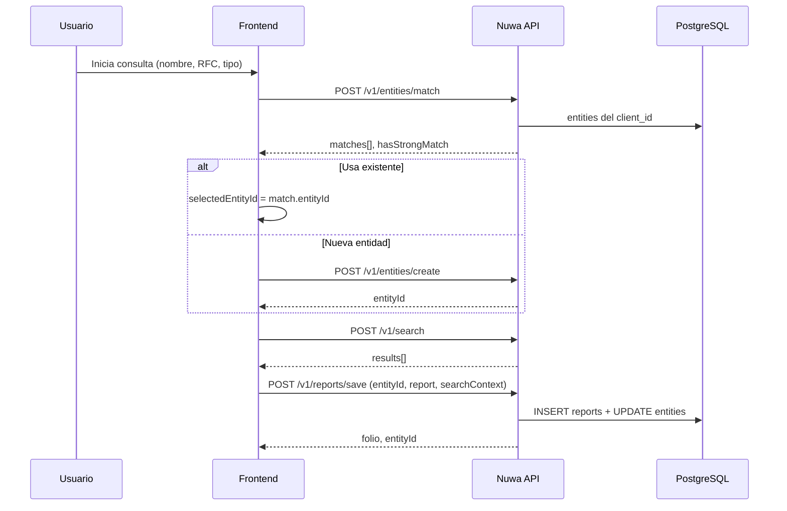

# Plan técnico: Entidades y Monitoreo Continuo (Nuwa 2.0 APIs)

Documento de diseño para alinear el backend (`APIs`) con el frontend (`b_CvPklPEoxLx`) y la pantalla **Gestion de Entidades** (`/entities`).

## 1. Contexto actual

| Capa | Hoy |
|------|-----|
| **Backend** | `POST /v1/search` sobre `risk_entity_chunks`; `POST /v1/reports/save` sin `entity_id`; tenant = `companies.client_id` (int). |
| **Frontend** | Match y CRUD en rutas Next `/api/entities/*` contra **Supabase** (UUID `company_id`); proxy a Nuwa solo para `/v1/search` y `/v1/reports/save`. |
| **Gap** | No existe tabla `entities` en migraciones del backend; el front espera `POST .../entities/match` persistente en el mismo Postgres que reportes. |

**Decisión de identidad:** usar **`client_id` INTEGER** (no UUID de Supabase) y **`entity_id` UUID** en todas las APIs Nuwa. El front debe enviar `numericClientId` / `numericUserId` del JWT (ya en `nuwa_session`).

---

## 2. Modelo de datos propuesto

### 2.1 Tabla `public.entities`

Registro maestro de Persona Física / Moral por tenant.

```sql
CREATE TABLE public.entities (
  id                  UUID PRIMARY KEY DEFAULT gen_random_uuid(),
  client_id           INTEGER NOT NULL REFERENCES public.companies(client_id) ON DELETE RESTRICT,
  created_by_user_id  BIGINT NOT NULL REFERENCES public.nuwa_users(id) ON DELETE RESTRICT,
  updated_by_user_id  BIGINT REFERENCES public.nuwa_users(id) ON DELETE SET NULL,

  name                TEXT NOT NULL,
  name_normalized     TEXT NOT NULL,  -- para match (sin acentos, lower)
  party_type          TEXT NOT NULL CHECK (party_type IN ('individual', 'organization')),
  category            TEXT NOT NULL DEFAULT 'screening' CHECK (category IN (
    'screening', 'background_check', 'employee', 'director',
    'vendor', 'client', 'associate', 'pep', 'representative', 'beneficial_owner'
  )),

  rfc                 TEXT,
  curp                TEXT,
  country             TEXT,

  risk_level          TEXT CHECK (risk_level IN ('low', 'medium', 'high', 'critical')),
  status              TEXT NOT NULL DEFAULT 'active' CHECK (status IN (
    'active', 'under_review', 'flagged', 'cleared', 'inactive', 'deleted'
  )),

  last_screening_at   TIMESTAMPTZ,
  last_report_folio   TEXT,
  metadata            JSONB NOT NULL DEFAULT '{}',

  created_at          TIMESTAMPTZ NOT NULL DEFAULT now(),
  updated_at          TIMESTAMPTZ NOT NULL DEFAULT now(),
  deleted_at          TIMESTAMPTZ,
  deleted_by_user_id  BIGINT REFERENCES public.nuwa_users(id)
);

CREATE UNIQUE INDEX uq_entities_client_rfc
  ON public.entities (client_id, upper(rfc)) WHERE rfc IS NOT NULL AND status <> 'deleted';
CREATE UNIQUE INDEX uq_entities_client_curp
  ON public.entities (client_id, upper(curp)) WHERE curp IS NOT NULL AND status <> 'deleted';
CREATE INDEX idx_entities_client_status ON public.entities (client_id, status);
CREATE INDEX idx_entities_client_party ON public.entities (client_id, party_type);
CREATE INDEX idx_entities_client_category ON public.entities (client_id, category);
CREATE INDEX idx_entities_name_norm ON public.entities (client_id, name_normalized);
```

**Notas:**
- `party_type` = PF/PM (`individual` / `organization`).
- `category` = pestañas del front (screening, empleados, etc.).
- `name_normalized` se mantiene por trigger o en aplicación al insert/update.

### 2.2 Tabla `public.entity_monitoring`

Configuración de **Monitoreo Continuo** (1 fila activa por entidad; historial opcional en `entity_monitoring_runs`).

```sql
CREATE TABLE public.entity_monitoring (
  id                  UUID PRIMARY KEY DEFAULT gen_random_uuid(),
  entity_id           UUID NOT NULL REFERENCES public.entities(id) ON DELETE CASCADE,
  client_id           INTEGER NOT NULL REFERENCES public.companies(client_id) ON DELETE RESTRICT,

  is_enabled          BOOLEAN NOT NULL DEFAULT true,
  frequency           TEXT NOT NULL DEFAULT 'weekly' CHECK (frequency IN (
    'weekly', 'monthly', 'semi-annual', 'annual'
  )),
  sources             TEXT[] NOT NULL DEFAULT ARRAY['compliance','media']::TEXT[],
  -- compliance = Sanciones, PEPs, Regulatorio (/search catálogo)
  -- media      = Medios Adversos (flujo Grok/medios en front; scheduler futuro)

  last_run_at         TIMESTAMPTZ,
  next_run_at         TIMESTAMPTZ,
  last_run_status     TEXT CHECK (last_run_status IN ('ok', 'error', 'skipped')),
  last_error          TEXT,

  created_by_user_id  BIGINT NOT NULL REFERENCES public.nuwa_users(id),
  created_at          TIMESTAMPTZ NOT NULL DEFAULT now(),
  updated_at          TIMESTAMPTZ NOT NULL DEFAULT now(),

  CONSTRAINT uq_entity_monitoring_entity UNIQUE (entity_id)
);

CREATE INDEX idx_entity_monitoring_due
  ON public.entity_monitoring (next_run_at)
  WHERE is_enabled = true;
```

**Scheduler (futuro):** ver spec unificado en el front Nuwa 2.0:  
`docs/CONTINUOUS_MONITORING_ARCHITECTURE_20260822.md` (EventBridge en madrugada `America/Mexico_City`, BFF encola rescreen).  
Resumen: `SELECT * FROM entity_monitoring WHERE is_enabled AND next_run_at <= now()` → enqueue BFF (no screening síncrono en Lambda).

### 2.3 Tabla `public.entity_monitoring_runs` (log)

```sql
CREATE TABLE public.entity_monitoring_runs (
  id                  UUID PRIMARY KEY DEFAULT gen_random_uuid(),
  monitoring_id       UUID NOT NULL REFERENCES public.entity_monitoring(id) ON DELETE CASCADE,
  entity_id           UUID NOT NULL REFERENCES public.entities(id),
  client_id           INTEGER NOT NULL,
  started_at          TIMESTAMPTZ NOT NULL DEFAULT now(),
  finished_at         TIMESTAMPTZ,
  status              TEXT NOT NULL CHECK (status IN ('running', 'ok', 'error')),
  report_folio        TEXT,
  risk_level_before   TEXT,
  risk_level_after    TEXT,
  error_message       TEXT
);
```

### 2.4 Tabla `public.entity_alerts` (fase 2)

```sql
CREATE TABLE public.entity_alerts (
  id                  UUID PRIMARY KEY DEFAULT gen_random_uuid(),
  client_id           INTEGER NOT NULL,
  entity_id           UUID NOT NULL REFERENCES public.entities(id),
  alert_type          TEXT NOT NULL CHECK (alert_type IN (
    'risk_change', 'new_match', 'new_media_mention', 'status_change'
  )),
  severity            TEXT NOT NULL CHECK (severity IN ('low', 'medium', 'high')),
  title               TEXT NOT NULL,
  description         TEXT,
  payload             JSONB NOT NULL DEFAULT '{}',
  status              TEXT NOT NULL DEFAULT 'new' CHECK (status IN ('new', 'reviewed', 'dismissed', 'escalated')),
  created_at          TIMESTAMPTZ NOT NULL DEFAULT now()
);
```

### 2.5 Cambios en `public.reports`

```sql
ALTER TABLE public.reports
  ADD COLUMN IF NOT EXISTS entity_id UUID REFERENCES public.entities(id) ON DELETE SET NULL;

CREATE INDEX IF NOT EXISTS idx_reports_entity
  ON public.reports (client_id, entity_id) WHERE status = 'active';
```

**`search_context`** (ya existe, hoy `{}`): al guardar reporte con entidad:

```json
{
  "entityId": "uuid",
  "partyType": "organization",
  "query": "Cisco Systems",
  "rfc": "…",
  "requestId": "…",
  "savedAt": "2026-05-16T…"
}
```

**`report_json.metadatos`:** duplicar `entityId` para compatibilidad con UI que lee solo JSON editorial.

---

## 3. APIs nuevas y modificadas

Todas bajo prefijo `/v1/entities`, tag OpenAPI **Entities**, auth **Bearer** + `ActorContext` (`clientId`, `userId`).

| Método | Ruta | Descripción |
|--------|------|-------------|
| POST | `/v1/entities/match` | Deduplicación pre-search (portar lógica de `entity-deduplication.ts`). |
| POST | `/v1/entities/create` | Alta de entidad; devuelve `entityId`. |
| POST | `/v1/entities/list` | Listado paginado + filtros (tabla /entities). |
| POST | `/v1/entities/get` | Detalle + reportes vinculados + monitoring. |
| POST | `/v1/entities/update` | Edición. |
| POST | `/v1/entities/delete` | Borrado lógico (`status=deleted`). |
| POST | `/v1/entities/stats` | Métricas widgets. |
| POST | `/v1/entities/monitoring/upsert` | Crear/actualizar monitoreo. |
| POST | `/v1/entities/monitoring/list` | Listado monitoreo activo (sidebar). |

### Modificaciones

| Ruta | Cambio |
|------|--------|
| `POST /v1/reports/save` | Body: `entityId` opcional; persistir columna + `search_context`; actualizar `entities.last_screening_at`, `risk_level`. |
| `POST /v1/reports/get` | Query/body opcional `entityId` para filtrar. |
| `POST /v1/reports/update` | Permitir actualizar `entityId` si se reasigna. |

### Implementación Lambda

- Nuevo: `handler_entities.py` + registro en `nuwa_api_stack.py` + `nuwa_pg_dispatch.py` (CRUD `entities`, `entity_monitoring`).
- Reutilizar normalización de nombres en Python (copiar reglas del front).
- Tests: `tests/test_handler_entities.py`, ampliar `tests/test_handler_reports.py` con `entityId`.

---

## 4. Flujos de negocio

### 4.1 Screening con match (flujo principal)



### 4.2 Monitoreo continuo

1. Tras tener `entityId`, si el usuario activó monitoreo: `POST /v1/entities/monitoring/upsert`.
2. `next_run_at` = now + intervalo según `frequency`.
3. Scheduler (EventBridge + Lambda, **iteración 2**) procesa vencidos y llama search + save con `esActualizacion: true` en metadatos.

### 4.3 Métricas `/entities`

`POST /v1/entities/stats` ejecuta agregaciones SQL filtradas por `client_id`:

- `inReviewCount`: `status IN ('under_review','flagged')`
- `individualsHighRisk`: `party_type='individual' AND risk_level IN ('high','critical')`
- `organizationsHighRisk`: `party_type='organization' AND …`
- `highRiskTotal`: suma de ambos

---

## 5. Mapeo UI Front ↔ API

| UI (español) | Campo API |
|--------------|-----------|
| Persona Física | `partyType: individual` |
| Persona Moral | `partyType: organization` |
| Pestaña Screening | `category: screening` |
| Semanal / Mensual / Semestral / Anual | `frequency: weekly \| monthly \| semi-annual \| annual` |
| Sanciones, PEPs y Regulatorio | `sources` incluye `compliance` |
| Medios Adversos | `sources` incluye `media` |
| En revisión | `status: under_review` |
| Riesgo alto | `riskLevel: high` o `critical` |

---

## 6. Decisiones de producto (cerradas)

| # | Decisión |
|---|----------|
| 1 | **Match solo entidades con actividad reciente:** `last_screening_at >= now() - 30 days` (o reporte activo en ese periodo). |
| 2 | **RFC y CURP únicos por tenant:** `POST /v1/entities/create` devuelve **409** si ya existe el mismo RFC o CURP (activo). |
| 3 | **Monitoreo continuo:** solo si existe `entity_id` (entidad guardada o creada en consulta previa). `monitoring/upsert` sin entidad → **400**. |
| 4 | **Relaciones (columna UI):** análisis futuro — cruces con documentos cargados por el `clientId` y consultas de otros `userId`; no es el campo `category` de pestañas. |
| 5 | **`category`:** ver §6.1 (pestañas Empleados/Directores vs tipo PF/PM). |
| 6 | **Grupo:** un `entityId` por miembro; con PM padre → `parentEntityId`; sin padre → `groupId` + `groupName`. |
| 7 | **Reportes múltiples:** un folio por sujeto + uno por PM si se verifica. |
| 8 | **Naming:** `groupName` en front y API (no `groupLabel`). |

### 6.1 Qué es `category` (aclaración)

No es “Persona física / moral”. Eso es **`party_type`** + **`party_type_label`**.

`category` son las **pestañas del listado** en `/entities`: Screening, Antecedentes, Empleados, Directores, Proveedores, Clientes, Asociados. Por defecto, entidades creadas desde una consulta de screening llevan `category = screening`. El usuario puede cambiarlas al editar la entidad (ej. marcar un empleado como `employee`).

### 6.2 Reglas de match por tipo de entidad

Campos alineados al front (`screening-search.tsx`, `_search-page-impl.tsx`):

| Tipo | Campos UI | Columnas `entities` | Match |
|------|-----------|----------------------|--------|
| **Persona moral** | Razón Social / Denominación, RFC (opcional) | `legal_name`, `rfc`, `name` = `legal_name` | Si hay **razón social + RFC**: coincidencia fuerte solo si **ambos** coinciden (normalizados). Si solo hay uno, match solo con ese campo (exacto RFC; nombre fuzzy ≥85 o exacto). |
| **Persona física** | Nombre(s), Apellido(s), RFC/CURP (un campo) | `first_name`, `last_name`, `rfc`, `curp`, `name` = concat | Clasificar identificador (CURP 18 chars, RFC PF 13). Si hay **nombre completo + RFC o CURP**: fuerte si **ambos** coinciden. Si solo nombre: match sobre `name_normalized`. Si solo RFC o CURP: exacto en columna correspondiente. |

**Ventana 30 días:** el candidato debe tener `last_screening_at` en los últimos 30 días (actualizado en cada `reports/save` con `entity_id`).

**`tipoConsulta` en reportes:** el front ya envía `"Persona física"` / `"Persona moral"` en `report.tipoConsulta`; en entidades persistir `party_type_label` con los mismos valores.

### 6.3 Identificador PF (RFC vs CURP)

El front usa un solo input `idNumber`; el backend debe clasificar (misma lógica que `identifier-classifier.ts`) al crear/actualizar:

- CURP → columna `curp`
- RFC PF → columna `rfc`
- Ambos no en la misma fila salvo que el usuario los capture por separado en APIs estructuradas

---

## 7. Orden de implementación sugerido

1. Migración SQL (`entities`, `entity_monitoring`, `reports.entity_id`).
2. `handler_entities`: match, create, list, get, stats.
3. Extender `handler_reports` save/get.
4. monitoring/upsert + list.
5. OpenAPI + smoke tests + `scripts/smoke_api.sh`.
6. Prompt front + migrar proxies Next de Supabase a Nuwa.
7. Scheduler + alertas (iteración 2).

---

## 7.1 Screening múltiple, roles y grupos

Ver documento detallado: **`docs/ENTIDADES_ROLES_Y_GRUPOS.md`**.

Resumen:
- Roles PF y PM son catálogos distintos (`relationshipRole`).
- Múltiples sujetos usan `fullName` + toggle PF/PM; reportes llevan `groupId`, `groupName`, `groupRole`, `parentEntityId`.
- El front debe renombrar `groupLabel` → `groupName` y enviar grupo en `POST /v1/reports/save`.

---

## 8. Referencias en el repositorio front

- Match: `app/api/entities/match/route.ts`, `lib/entity-deduplication.ts`
- Entidades UI: `app/entities/page.tsx`, `components/entities/*`
- Monitoreo: `components/screening/screening-search.tsx`, `app/api/monitoring/route.ts`
- Save reporte: `app/api/screening/save-report/route.ts`
- Esquema Supabase legacy: `scripts/004_entities.sql`, `scripts/007_monitoring.sql`
